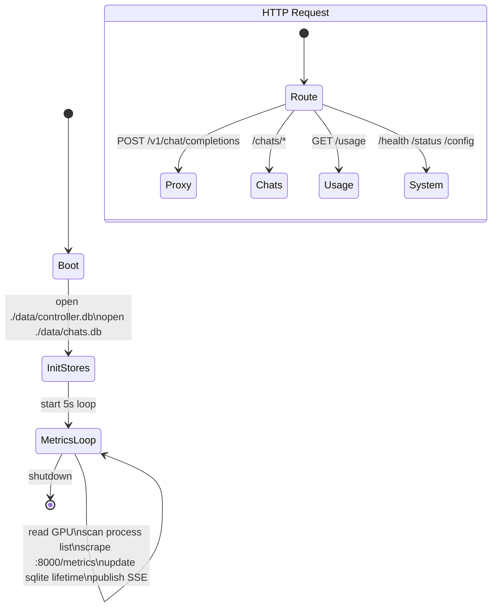
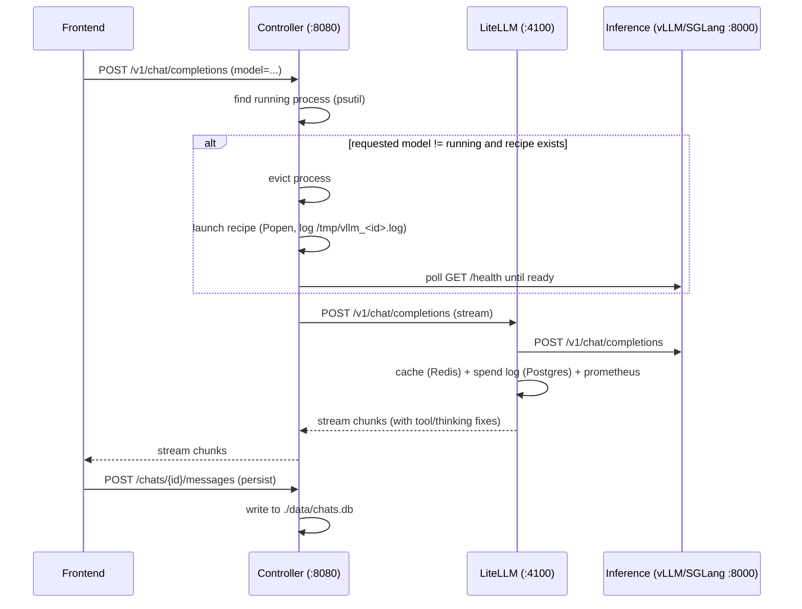
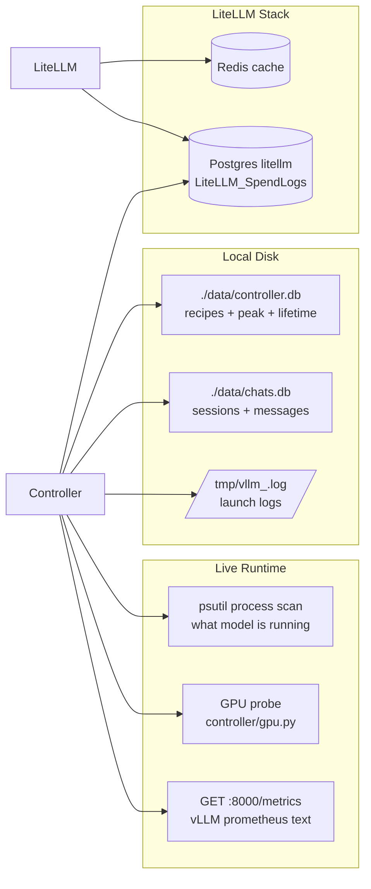

# Architecture (Controller + LiteLLM + Inference)

## Controller (FastAPI) high-level state

```mermaid
stateDiagram-v2
  [*] --> Boot
  Boot --> InitStores: open ./data/controller.db\nopen ./data/chats.db
  InitStores --> MetricsLoop: start 5s loop
  MetricsLoop --> MetricsLoop: read GPU\nscan process list\nscrape :8000/metrics\nupdate sqlite lifetime\npublish SSE
  MetricsLoop --> [*]: shutdown

  state "HTTP Request" as HTTP {
    [*] --> Route
    Route --> Proxy: POST /v1/chat/completions
    Route --> Chats: /chats/*
    Route --> Usage: GET /usage
    Route --> System: /health /status /config
  }
```

## Chat completion request path

```mermaid
sequenceDiagram
  participant UI as Frontend
  participant C as Controller (:8080)
  participant L as LiteLLM (:4100)
  participant I as Inference (vLLM/SGLang :8000)

  UI->>C: POST /v1/chat/completions (model=...)
  C->>C: find running process (psutil)
  alt requested model != running and recipe exists
    C->>C: evict process
    C->>C: launch recipe (Popen, log /tmp/vllm_<id>.log)
    C->>I: poll GET /health until ready
  end
  C->>L: POST /v1/chat/completions (stream)
  L->>I: POST /v1/chat/completions
  L->>L: cache (Redis) + spend log (Postgres) + prometheus
  L-->>C: stream chunks (with tool/thinking fixes)
  C-->>UI: stream chunks
  UI->>C: POST /chats/{id}/messages (persist)
  C->>C: write to ./data/chats.db
```

## Data sources (where “data” comes from)

```mermaid
flowchart LR
  subgraph LocalDisk[Local Disk]
    SQLite1[./data/controller.db\nrecipes + peak + lifetime]
    SQLite2[./data/chats.db\nsessions + messages]
    Logs[/tmp/vllm_<recipe>.log\nlaunch logs/]
  end

  subgraph Live[Live Runtime]
    Proc[psutil process scan\nwhat model is running]
    GPU[GPU probe\ncontroller/gpu.py]
    VMetrics[GET :8000/metrics\nvLLM prometheus text]
  end

  subgraph LiteLLMStack[LiteLLM Stack]
    Redis[(Redis cache)]
    PG[(Postgres litellm\nLiteLLM_SpendLogs)]
  end

  Controller[Controller] --> SQLite1
  Controller --> SQLite2
  Controller --> Proc
  Controller --> GPU
  Controller --> VMetrics
  Controller --> PG
  LiteLLM --> Redis
  LiteLLM --> PG
  Controller --> Logs
```
