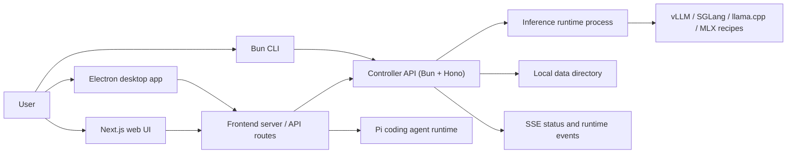
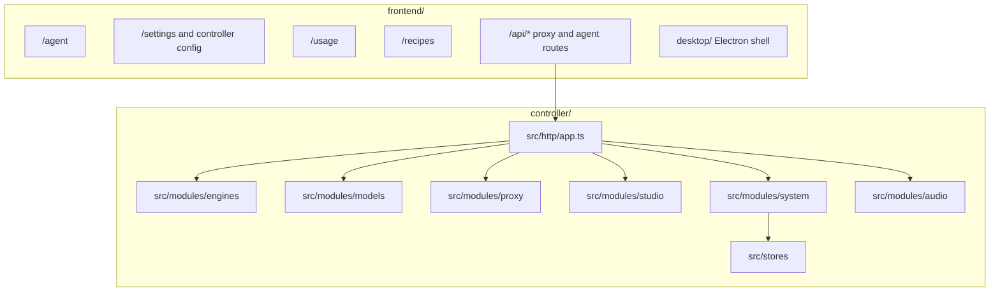

# vLLM Studio

vLLM Studio is a local-first workstation for running, managing, and using self-hosted LLM backends. It combines a controller API, a Next.js/Electron interface, and a small CLI so one machine can launch models, watch GPU/runtime state, chat with OpenAI-compatible endpoints, and run agent sessions against local or remote controllers.

## What Is A Controller?

A controller is the backend process that the UI and CLI talk to. In this repo it is the Bun/Hono server in `controller/`.

The controller owns:

- Model lifecycle operations such as launch, evict, status, recipes, downloads, and runtime process coordination.
- OpenAI-compatible proxy routes for chat, models, tokenization, audio, and related inference calls.
- System state such as GPU metrics, logs, usage data, controller settings, and server-sent events.
- Controller integrations used by the frontend and CLI.

You can run one controller locally or connect the frontend to a remote controller on a GPU host.

## Prerequisites

- macOS or Linux for local development.
- Node.js 20+ and npm for the frontend and desktop build.
- Bun 1.x for the controller and CLI.
- Optional NVIDIA GPU stack for CUDA model serving: NVIDIA driver, CUDA-compatible runtime, and whichever serving backend your recipe uses.
- Optional Apple Silicon stack for MLX recipes: macOS on Apple Silicon and a Python environment with `mlx-lm`.
- Optional llama.cpp binary for GGUF recipes: a runnable `llama-server` on `PATH` or configured through `VLLM_STUDIO_LLAMA_BIN`.
- Optional Docker if you run infrastructure through `docker-compose.yml`.
- SSH access plus `.env.local` deployment variables when deploying to the remote GPU host.

Sensitive deployment values belong in `.env.local`, not in Git. See `.env.example` for the expected variable names.

## Agent Runtime

The agent surface lives at `/agent` in the frontend. It uses `@earendil-works/pi-coding-agent` through the frontend runtime rather than shelling out to a separate agent process for normal turns. Agent skills and extensions are loaded by the frontend runtime and surfaced in the session UI.

## Architecture





## Repository Modules

- [`frontend/`](frontend/README.md): Next.js app, Electron desktop shell, agent UI, settings, usage, and browser-facing API routes.
- [`controller/`](controller/README.md): Bun/Hono controller API for lifecycle, runtime targets, proxying, metrics, logs, downloads, and settings.
- [`cli/`](cli/README.md): Bun CLI for checking and operating a controller from a terminal.
- [`scripts/`](scripts/): repo-level operational scripts, including remote deployment and daemon helpers.
- [`data/`](data/): local runtime data. Treat generated contents as machine-local state.

## Run Locally

Controller:

```bash
cd controller
bun install
bun src/main.ts
```

Frontend:

```bash
cd frontend
npm ci
npm run dev
```

CLI:

```bash
cd cli
bun install
bun src/main.ts status
```

The default controller URL is `http://localhost:8080`. The default frontend URL is `http://localhost:3000` unless you choose another port.

## Deploy A Controller

Remote deployment is handled by `scripts/deploy-remote.sh`. Configure `.env.local` first:

```bash
REMOTE_HOST=192.168.x.x
REMOTE_USER=username
REMOTE_PATH=/home/user/project
REMOTE_URL=https://your-domain.example
```

Deploy or inspect status:

```bash
./scripts/deploy-remote.sh controller
./scripts/deploy-remote.sh frontend
./scripts/deploy-remote.sh status
```

Local daemon helpers are also available:

```bash
./scripts/daemon-start.sh
./scripts/daemon-status.sh
./scripts/daemon-stop.sh
```

## Connect To Controller(s)

The frontend can target a controller by environment variable or by saved controller settings in the app.

Common environment variables:

- `BACKEND_URL`
- `NEXT_PUBLIC_BACKEND_URL`
- `VLLM_STUDIO_BACKEND_URL`

If none are provided, frontend code falls back to `http://localhost:8080`. Controller management and switching is available from the app settings surface.

The CLI uses `VLLM_STUDIO_URL`, defaulting to `http://localhost:8080`.

## Runtime Backends

Recipes can launch through the controller runtime layer. The currently wired backend families are:

- `vllm`: vLLM server recipes through a configured, discovered, system, Docker, or bundled runtime target.
- `sglang`: SGLang launch-server recipes through configured or discovered Python targets.
- `llamacpp`: llama.cpp `llama-server` recipes for GGUF models.
- `mlx`: MLX `mlx_lm.server` recipes for Apple Silicon environments.
- `exllamav3`: ExLlama v3 through an explicit command override.

Runtime target discovery is surfaced in Settings, and selected targets are persisted in the controller data directory.

## Validation

Common checks:

```bash
npm run check
npm run test:e2e
```

`npm run check` runs the frontend production quality gate plus controller and CLI typechecks. The configured pre-push hook runs the frontend quality gate before pushing.
