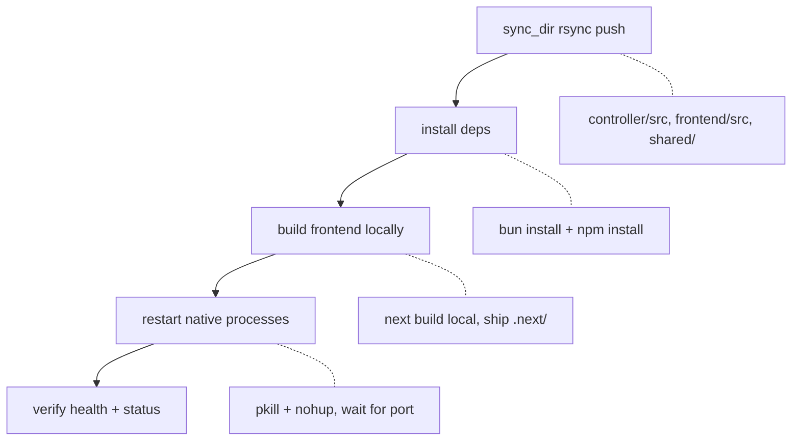

# Deployment

vLLM Studio ships in three forms: a native deploy to a remote GPU server, container images for the controller and frontend, and a signed Electron desktop app. This page covers each path and the CI/CD workflows that drive them.

## Targets at a glance

| Target | What runs | How |
| --- | --- | --- |
| Remote GPU server | Controller (Bun, `:8080`) + frontend (Next, `:3000`) native; Postgres in Docker | `scripts/deploy-remote.sh` |
| Containers | Controller and frontend images | `controller/Dockerfile`, `frontend/Dockerfile`, `docker-compose.yml` |
| Desktop app | Self-contained Electron app bundling its own frontend | `electron-builder` via `frontend/desktop/electron-builder.yml` |

## Remote GPU deploy

`scripts/deploy-remote.sh` pushes the working tree from the local machine to the remote GPU host over SSH and restarts the native processes. The controller and frontend run natively (not in Docker) because they need `nvidia-smi` access and host process visibility.

### Connection config

Connection values are loaded from `.env.local` (gitignored):

- `REMOTE_HOST`, `REMOTE_USER`, `REMOTE_PATH` — required.
- `REMOTE_SSH_KEY` — optional, defaults to `~/.ssh/id_ed25519`.

### What the script does



1. **Sync** — `rsync -az --delete` pushes `controller/src`, `frontend/src`, and `shared/`, excluding `node_modules`, `.next`, lockfiles, and test files (`sync_dir` in `scripts/deploy-remote.sh`).
2. **Install** — `bun install --frozen-lockfile` for the controller (falls back to a plain `bun install`), `npm install` for the frontend.
3. **Build** — the frontend is built locally (`npm run build`) and the resulting `.next/` is rsynced to the remote. The script builds locally because the remote `next build` is unreliable on that host.
4. **Restart** — old processes are killed (`pkill`, `fuser -k <port>/tcp`), then restarted under `nohup` (`bun run controller/src/main.ts`, `npx next start`), waiting for the port to listen (`wait_port`).
5. **Verify** — `show_status` probes `/health`, the frontend, the proxy, and the inference port, then prints GPU and running-model info.

### Subcommands

| Command | Action |
| --- | --- |
| `./scripts/deploy-remote.sh` (or `all`) | Sync, install, start infra, restart everything, status. |
| `./scripts/deploy-remote.sh controller` | Controller only. |
| `./scripts/deploy-remote.sh frontend` | Frontend only (includes local build). |
| `./scripts/deploy-remote.sh infra` | Restart Docker infra (Postgres). |
| `./scripts/deploy-remote.sh status` | Probe what's running; makes no changes. |

### Transport note

Per `AGENTS.md`, plain `rsync`/`scp` can fail because of remote shell output; the script works around this with SSH option `-T` (no TTY) and rsync over an explicit `ssh $SSH_OPTS` transport. Remote command execution is funneled through the `remote()` helper.

This deploy updates only the homelab web UI (`:3000`) and controller. It does **not** update the desktop app, which bundles its own frontend.

## Docker

`docker-compose.yml` runs **infrastructure only** — a `postgres:16` service on `:5432` with a healthcheck and a `./data/postgres` volume. The comment in the compose file is explicit that the controller and frontend run natively, not in Docker, on the GPU host.

Container images still exist for portable deploys:

- `controller/Dockerfile` — `oven/bun:1.3.9`, installs deps, runs `bun src/main.ts`, exposes `:8080`.
- `frontend/Dockerfile` — multi-stage `node:20-alpine` build producing the Next.js standalone output, running as a non-root `nextjs` user, exposing `:3000` with `HOSTNAME=0.0.0.0`.

The frontend image is built and pushed to GHCR by CI (see below).

## Desktop distribution

The desktop app is built with `electron-builder` using `frontend/desktop/electron-builder.yml`.

- **App identity**: `appId: org.vllm.studio.desktop`, `productName: vLLM Studio`.
- **Bundled frontend**: `extraResources` copies the Next.js `.next/standalone`, `.next/static`, and `public/` into the app so the packaged app serves its own embedded Next server. This is why frontend changes require a desktop rebuild.
- **Bundled Pi resources**: `desktop/resources/pi-extensions` and `desktop/resources/skills` are copied in as `extraResources`.

### Build modes

| Command | Output | Use |
| --- | --- | --- |
| `npm run desktop:pack` | App directory only (`frontend/dist-desktop/mac-arm64/vLLM Studio.app`) | Fast local test build. |
| `npm run desktop:dist` | Signed app + DMG/ZIP distributables | Production / release. |

### Signing and notarization

The macOS target sets `hardenedRuntime: true` and points `entitlements`/`entitlementsInherit` at `desktop/resources/entitlements.mac.plist`. It signs with the real Apple Developer ID Application certificate (`identity: "sherif cherfa (TZ447KHNZL)"`), whose private key must be present in the login keychain. A custom signing helper lives at `frontend/desktop/codesign-shim/codesign`.

### Auto-update

The desktop app uses `electron-updater` for auto-update (DMG/ZIP targets produce the update artifacts). See [Desktop app](apps/desktop.md) for the update flow and IPC surface.

### Installing the built app

Per `AGENTS.md`, there must be exactly one canonical install: `/Applications/vLLM Studio.app` (bundle id `org.vllm.studio.desktop`). After `desktop:pack` or `desktop:dist`, replace the bundle cleanly rather than layering a new bundle on top of the old one (stale sealed resources invalidate the signature):

```bash
rm -rf "/Applications/vLLM Studio.app"
ditto "frontend/dist-desktop/mac-arm64/vLLM Studio.app" "/Applications/vLLM Studio.app"
```

Then force LaunchServices to re-register the replaced bundle before relaunching by full path (otherwise `open -a` can fail with `-600`):

```bash
killall "vLLM Studio" >/dev/null 2>&1 || true
for i in $(seq 1 20); do
  pgrep -x "vLLM Studio" >/dev/null || break
  sleep 0.5
done
/System/Library/Frameworks/CoreServices.framework/Frameworks/LaunchServices.framework/Support/lsregister -f "/Applications/vLLM Studio.app"
open "/Applications/vLLM Studio.app"
```

The `rm -rf` of the installed app is a destructive step; confirm before running it.

## CI/CD

| Workflow | Trigger | Action |
| --- | --- | --- |
| `.github/workflows/deploy.yml` | Push to `main` touching `controller/`, `cli/`, `frontend/`, compose/Dockerfile | Records a GitHub Deployment (status tracking; the actual native deploy is run via `scripts/deploy-remote.sh`). |
| `.github/workflows/deploy-frontend.yml` | Push to `main` touching `frontend/**`, or manual | Builds `frontend/Dockerfile` with Buildx and pushes to GHCR (`ghcr.io/<repo>/frontend`), tagged by SHA and `latest`. |
| `.github/workflows/release.yml` | Push to `main` | Runs `semantic-release` (config in `release.config.cjs`) to create GitHub Releases and tags from conventional commits. |

`deploy.yml` creates a deployment record and marks it success/failure via `chrnorm/deployment-action`; it does not itself SSH into the GPU host. `release.config.cjs` is configured for GitHub Release + tags only (no root npm package publish).

## See also

- [Desktop app](apps/desktop.md)
- [Tooling](how-to-contribute/tooling.md)
- [Security](security.md)
