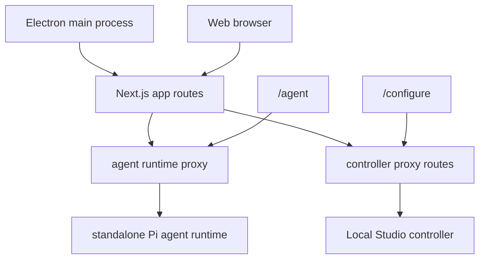

# Frontend

`frontend/` is the Next.js 16 and React 19 interface for Local Studio and the
source of the macOS Electron app. The web and desktop builds share the same
routes, agent runtime integration, controller API bridge, and UI kit.

## Product Surface

- `/` — controller and hardware status.
- `/agent` — Workbench sessions, panes, Pi agent runtime, terminals, browser,
  files, skills, and extensions.
- `/configure` — overview, machines, models, integrations, and server controls.
- `/usage` — inference and session usage.
- `/settings` — application, connection, appearance, agent, and setup settings.
- `/logs` — controller log sessions.

`/recipes`, `/discover`, `/integrations`, and `/server` are compatibility
redirects into Configure. New navigation must target the canonical route.

## Architecture



The Pi execution and browser-host routes always run in the standalone
`services/agent-runtime/` sidecar. Next proxies those routes while importing
shared contracts and non-runtime services from the package. Shared controller
HTTP shapes come from `@local-studio/contracts`; frontend and agent-runtime
shapes come from `shared/agent/`.

## Requirements and Commands

Node.js 22.19+, npm, and a reachable controller are required for the full
surface. The default controller URL is `http://localhost:8080`.

> **Security boundary:** Frontend access grants the coding agent permission to
> execute shell commands and read or write files as the Local Studio host user.

Before production `npm run start`, copy `.env.example` to `.env.local` and set
`LOCAL_STUDIO_FRONTEND_TOKEN`. Use
`LOCAL_STUDIO_FRONTEND_ALLOW_UNAUTHENTICATED=true` only as an explicit opt-out
on an isolated, trusted network. Production startup fails without one of these
settings. Development and the loopback-only desktop app use separate trust
boundaries.

```bash
npm ci
npm run build
npm run start
npm run typecheck
npm run typecheck:desktop
npm run lint
npm run check:quality
```

`npm run start` uses `scripts/start-standalone.mjs`; plain `next start` does not
preserve the streaming runtime contract.

## Remote / LAN

Create `frontend/.env.local` on the remote host from this directory's
`.env.example` before starting or deploying the frontend. The deployment script
does not transfer this secret file. Configure the controller URL separately
with `BACKEND_URL` or `NEXT_PUBLIC_API_URL`.

Treat every user who can reach and authenticate to the remote frontend as a
host shell and filesystem user. A controller API key protects the controller;
it does not reduce frontend agent privileges.

## Desktop

```bash
npm run desktop:build:main
npm run desktop:start
npm run desktop:pack
npm run desktop:dist
```

`desktop:pack` creates a fast local bundle. `desktop:dist` creates the signed
DMG, updater ZIP, blockmaps, and update metadata. The only canonical install is
`/Applications/Local Studio.app` with bundle id `org.local.studio.desktop`.
Run `APPLE_KEYCHAIN_PROFILE=vllm-studio-notarize npm run
desktop:dist:notarized` to submit and staple the app when the Apple developer
team has an active agreement.

## Controller Connection

Controller URL resolution lives in `src/lib/backend-config.ts` and accepts
`BACKEND_URL`, `NEXT_PUBLIC_BACKEND_URL`, or `LOCAL_STUDIO_BACKEND_URL`. Durable
desktop preferences preserve controller URLs locally without copying controller
credentials into the controller database.

## Code Map

- `src/app/` — thin route and API shells.
- `src/features/agent/` — Workbench sessions, messages, workspace, and UI.
- `src/features/configure/` — consolidated controller configuration.
- `src/features/settings/` — application settings and runtime target controls.
- `src/features/integrations/` — plugins, connectors, skills, and speech.
- `src/lib/` and `src/hooks/` — shared modules with multiple feature consumers.
- `src/ui/` — shared primitives and ZCode design tokens.
- `desktop/` — Electron main process, resources, signing, and packaging.
