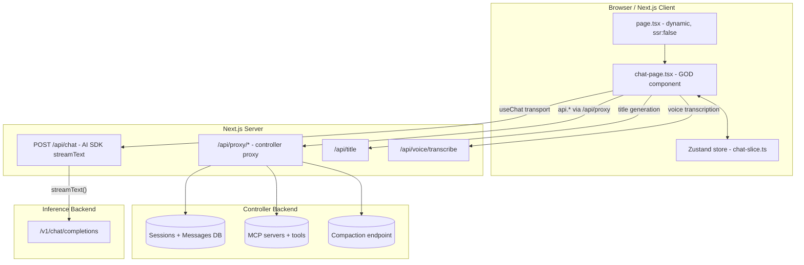
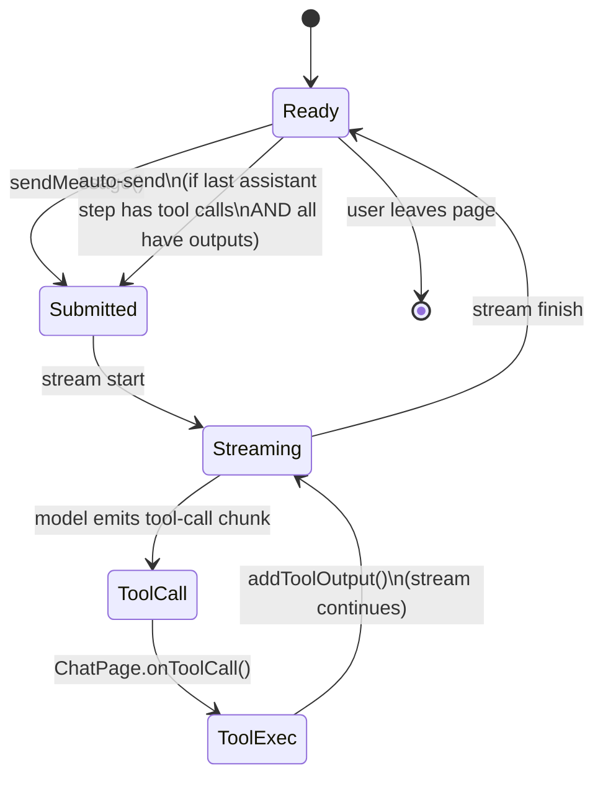
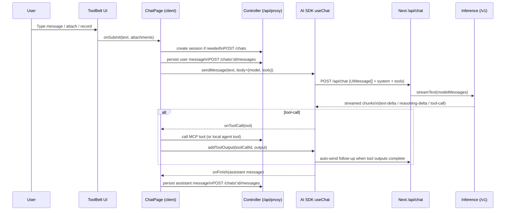
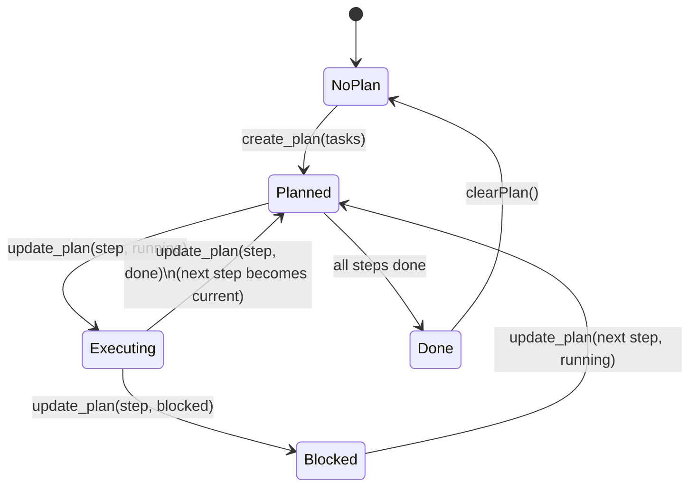
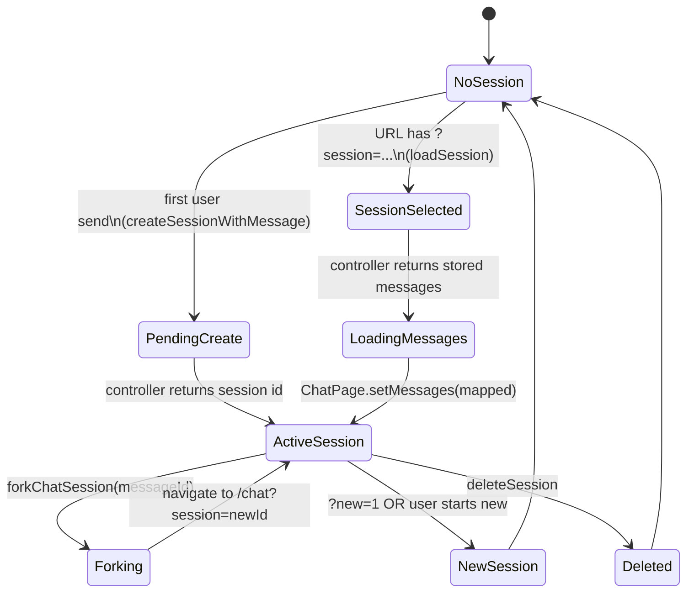
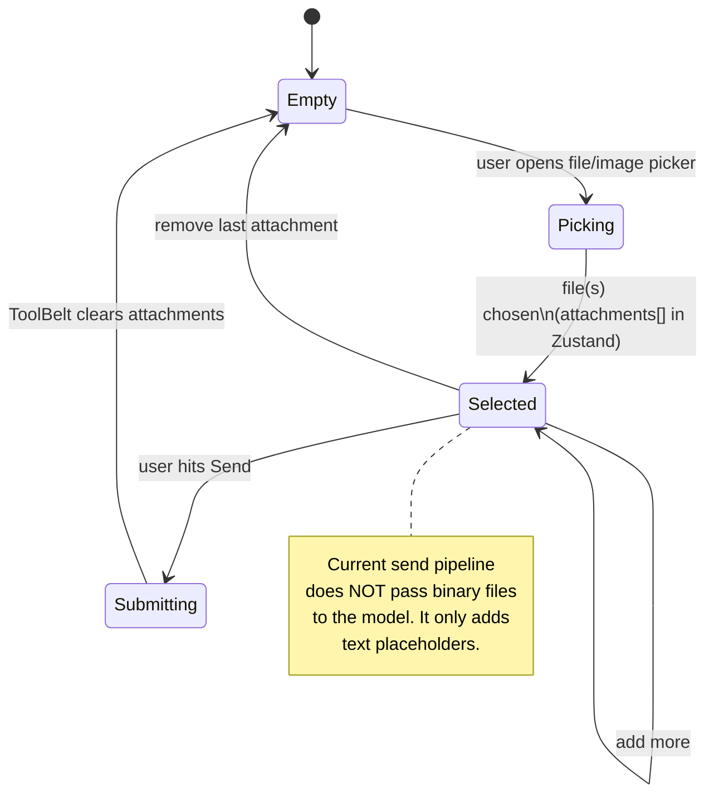
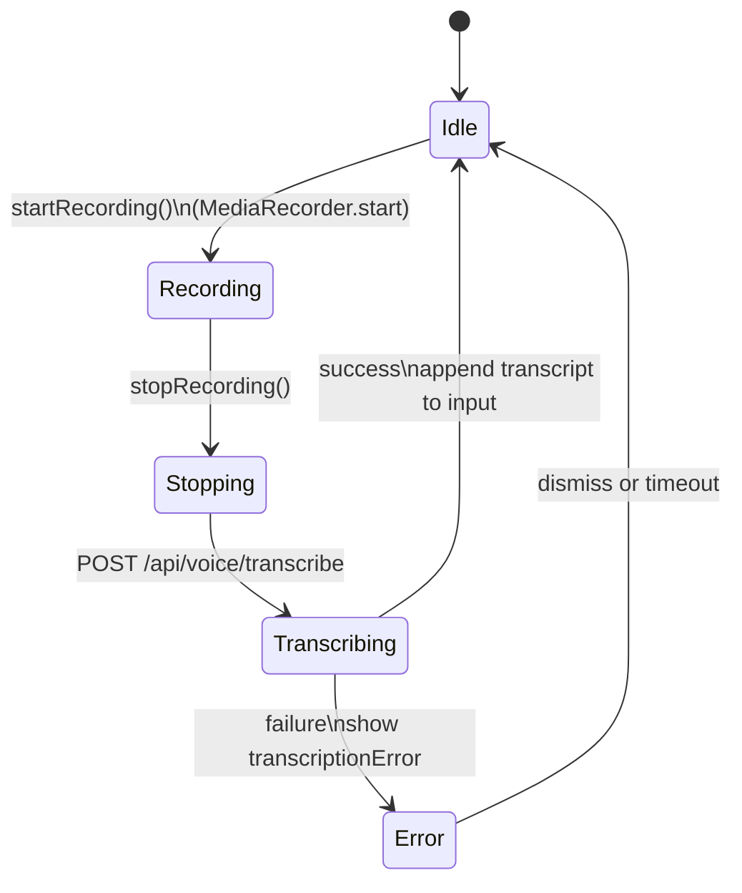
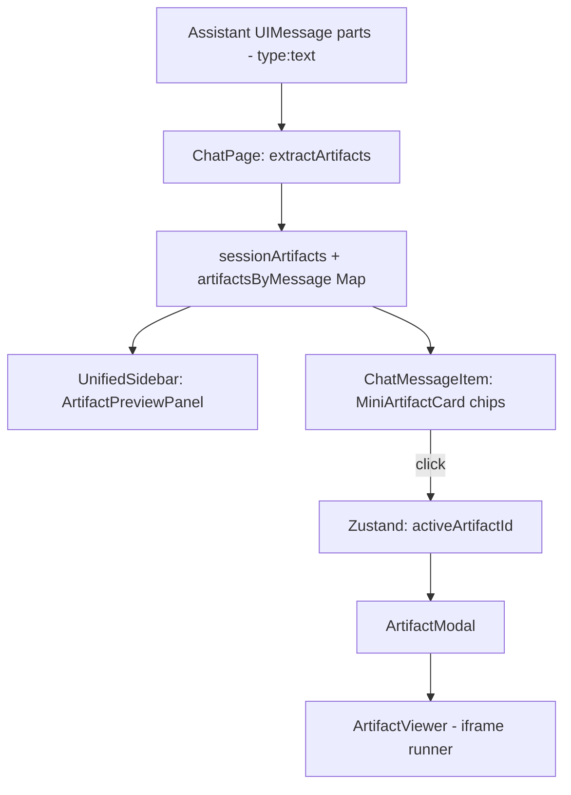
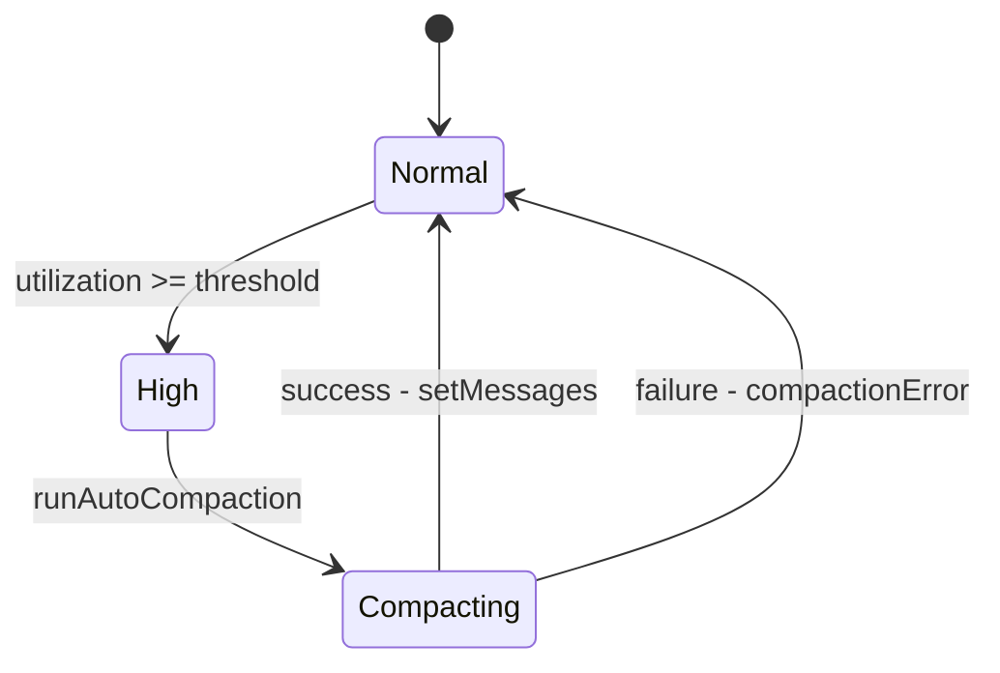
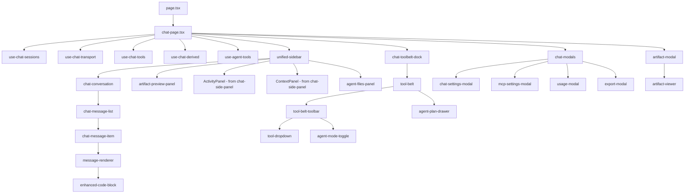

<!-- CRITICAL -->
# Chat system map (Frontend)

Scope (MUST stay accurate):
- `src/app/api/chat/**`
- `src/app/chat/**`

Goal of this document:
- Give a **complete mental model** of the chat feature.
- Map **every file** in-scope, what it does, what depends on it, and whether it’s active/legacy/partial.
- Provide **visual diagrams** (Mermaid) for runtime flows + state machines.
- Identify likely **dead code**, **duplicate code paths**, and **unintegrated features**.

Non-goals:
- This file does **not** implement refactors.
- It can propose consolidation targets, but it should not prescribe UI/UX.

---

## 0) Glossary

- **AI SDK**: `ai` + `@ai-sdk/react`. Provides `useChat`, `DefaultChatTransport`, streaming UIMessage protocol, and automatic tool-loop support.
- **UIMessage**: A message shape used by AI SDK (`role` + `parts[]`). This is the **source of truth** for in-memory conversation in the browser.
- **Tool loop**: Model emits tool calls → client executes tool → client provides tool output → AI SDK automatically re-requests the model until no more tool calls.
- **Controller**: vLLM Studio backend that stores sessions/messages, MCP config, runs tools, etc. Accessed from browser via `/api/proxy/...` (not in scope, but critical dependency).
- **Inference backend**: OpenAI-compatible `/v1` endpoint (vLLM/LiteLLM/etc). Used by `src/app/api/chat/route.ts`.
- **Artifacts**: Code/UI snippets extracted from assistant text (` ```artifact-* ``` ` or `<artifact ...>`), shown in preview UI.
- **Agent Plan**: Synthetic tools `create_plan` + `update_plan` that let the model maintain a checklist in agent mode.

---

## 1) High-level architecture (3 “planes”)

### 1.1 Runtime system diagram



### 1.2 The two “chat backends” (important)

There are **two different network paths** in play:

1) **Model response streaming**
- Client sends messages to **Next route**: `POST /api/chat`
- Next route streams from **inference backend** via AI SDK.

2) **Session persistence + tools (controller)**
- Client uses `api.*` (`src/lib/api.ts`) which hits `/api/proxy/...`.
- Controller stores sessions/messages, exposes MCP tools, compaction, usage, etc.

This split is a major source of complexity:
- Messages are streamed from inference **but stored** via controller.
- Tool execution happens client-side (MCP tool call via controller, then tool output back into AI SDK stream).

---

## 2) Core runtime loops (state machines)

### 2.1 Chat streaming + tool loop (AI SDK)

Key configuration (in `chat-page.tsx`):
- `useChat({ sendAutomaticallyWhen: lastAssistantMessageIsCompleteWithToolCalls, onToolCall })`



Notes:
- Tool calls are **not executed on the server** in `/api/chat`. They are emitted to the client.
- The client’s `onToolCall` decides how to execute:
  - MCP tool → controller `/mcp/tools/{server}/{tool}`
  - Agent synthetic tool (`create_plan`, `update_plan`) → local state update

### 2.2 End-to-end sequence diagram (user message)



### 2.3 Agent Plan state machine



Where it lives:
- Tool definitions + execution: `src/app/chat/hooks/use-agent-tools.ts`
- UI: `src/app/chat/_components/agent/agent-plan-drawer.tsx`

### 2.4 Session lifecycle state machine



### 2.5 Attachments lifecycle (UI)



### 2.6 Voice recording + transcription lifecycle



### 2.7 Artifact lifecycle (extraction → preview → modal)



### 2.8 Context compaction lifecycle (auto)



### 2.9 Intra-chat component graph (in-scope)



---

## 3) Feature map (what’s implemented vs partial vs missing)

Legend:
- ✅ Implemented + integrated
- 🟡 Implemented but partial / missing wiring
- 🔴 Missing (UI stub or config only)

| Feature | Status | Primary files | Notes |
|---|---:|---|---|
| Basic chat with streaming | ✅ | `chat-page.tsx`, `/api/chat/route.ts` | Uses AI SDK `useChat` streaming. |
| Session history (list/load/fork) | ✅ | `use-chat-sessions.ts`, `use-chat-transport.ts`, `chat-page.tsx` | Uses controller `/chats`. Messages loaded into `useChat` via `setMessages`. |
| System prompt editing | ✅ | `chat-settings-modal.tsx`, `chat-page.tsx` | Stored in Zustand, injected into `/api/chat` via transport `body`. |
| MCP tools execution | ✅/🟡 | `use-chat-tools.ts`, `chat-page.tsx` | Tool calls work; **tool outputs are not obviously persisted** (depends on controller schema). |
| Activity view (thinking + tools timeline) | ✅ | `use-chat-derived.ts`, `chat-side-panel.tsx` (ActivityPanel) | Shows tool calls + thinking extraction. |
| Context stats + auto-compaction | ✅/🟡 | `chat-page.tsx` + `src/lib/services/context-management/*` | Auto-compaction is implemented and updates session/messages; heavy coupling in ChatPage. |
| Artifact extraction + preview UI | ✅/🟡 | `artifact-renderer.tsx` (extract), `artifact-preview-panel.tsx`, `artifact-modal.tsx`, `artifact-viewer.tsx` | Works, but **multiple overlapping implementations** exist. |
| File attachments | 🟡 | `tool-belt.tsx` | UI supports adding files/images. **Sending to model is currently text placeholders** (not actual file parts). |
| Image attachments | 🟡 | `tool-belt.tsx` | Base64 is computed for images, but not passed to model in current send path. |
| Audio recording | 🟡 | `tool-belt.tsx`, `/api/voice/transcribe` (external) | Records audio, transcribes to text, appends to input. Not sent as audio part. |
| Deep Research | 🔴/🟡 | `chat-settings-modal.tsx`, `tool-belt-toolbar.tsx`, `chat-slice.ts` | Toggle exists; no observable effect in chat send pipeline in this directory. |
| Agent Files / virtual filesystem | 🔴 | `agent-files-panel.tsx` | UI placeholder; ChatPage passes `files={[]}`. No backend wiring here. |
| Agent planning tools (`create_plan`, `update_plan`) | ✅ | `use-agent-tools.ts`, `agent-plan-drawer.tsx`, `chat-page.tsx` | Synthetic tools merged into tool list when agent mode is on. |
| TTS | 🔴/🟡 | `tool-belt.tsx`, `tool-belt-toolbar.tsx`, store | Toggle exists; no speech synthesis in chat rendering here. |
| Queue next message while streaming | 🟡 | `tool-belt.tsx`, store `queuedContext` | UI supports entering `queuedContext` during streaming; no auto-submit logic found in this directory. |

---

## 4) State management model (Zustand)

**Important:** messages are NOT stored in Zustand.
- Messages live inside `useChat()`.
- Zustand stores UI state, sessions list/metadata, tool execution status, attachments, artifacts UI state, etc.

### 4.1 Zustand keys used directly by chat UI

Primary store file (external dependency): `src/store/chat-slice.ts`

Core keys used by ChatPage:
- Input: `input`, `setInput`
- Model: `selectedModel`, `availableModels`
- System prompt: `systemPrompt`
- Feature toggles: `mcpEnabled`, `artifactsEnabled`, `deepResearch`, `agentMode`
- Timing: `streamingStartTime`, `elapsedSeconds`
- Context queue: `queuedContext`
- Artifacts: `activeArtifactId`
- Session metadata: `currentSessionId`, `currentSessionTitle`, `sessions[]`
- Tool execution: `executingTools`, `toolResultsMap`
- Agent plan: `agentPlan`

### 4.2 Likely legacy / unused state

These keys appear to be from a previous side-panel implementation and may now be unused or inconsistently used:
- `toolPanelOpen`, `activePanel` (ChatPage now uses `UnifiedSidebar` local state)
- `artifactPanelSelectedId` (only used by `ArtifactPanel`, which is only used by dead `ChatSidePanel`)

If you remove legacy UI components, the corresponding store keys can be removed.

---

## 5) Directory inventory (every file)

### 5.1 In-scope file tree

```
src/app/api/chat/
  route.ts

src/app/chat/
  page.tsx
  types.ts
  utils/index.ts
  hooks/
    use-agent-tools.ts
    use-chat-derived.ts
    use-chat-sessions.ts
    use-chat-tools.ts
    use-chat-transport.ts
    use-chat-usage.ts
  _components/
    agent/
      agent-files-panel.tsx
      agent-mode-toggle.tsx
      agent-plan-drawer.tsx
      agent-types.ts
      index.ts
    artifacts/
      artifact-modal.tsx
      artifact-panel.tsx
      artifact-preview-panel.tsx
      artifact-renderer.tsx
      artifact-viewer.tsx
      mini-artifact-card.tsx
    code/
      code-sandbox.tsx
      enhanced-code-block.tsx
    input/
      attachments-preview.tsx
      recording-indicator.tsx
      tool-belt-toolbar.tsx
      tool-belt.tsx
      tool-dropdown.tsx
      transcription-status.tsx
    layout/
      chat-action-buttons.tsx
      chat-conversation.tsx
      chat-modals.tsx
      chat-page.tsx
      chat-side-panel.tsx
      chat-splash-canvas.tsx
      chat-toolbelt-dock.tsx
      chat-top-controls.tsx
      resizable-panel.tsx
      unified-sidebar.tsx
    messages/
      chat-message-item.tsx
      chat-message-list.tsx
      message-renderer.tsx
      typing-indicator.tsx
```

---

## 6) File-by-file documentation (with “status”)

### src/app/api/chat/route.ts (✅ ACTIVE)

**Role:** Next.js API route implementing `POST /api/chat`.

**Responsibilities:**
- Accepts `{ messages: UIMessage[], model?, tools?, system? }`.
- Converts `UIMessage[]` → model messages via `convertToModelMessages(messages)`.
- Builds a **ToolSet** from client-provided tool schemas.
- Calls `streamText({ model, messages, system, tools })` with OpenAI-compatible backend.
- Returns `toUIMessageStreamResponse({ sendReasoning: true, messageMetadata })`.

**Key property:** Tool execution is **client-side**. The server only provides tool schemas.

**Dependencies:**
- `getApiSettings()` (external): provides backend URL and API key.

---

### src/app/chat/page.tsx (✅ ACTIVE)

**Role:** `/chat` page entry. Uses dynamic import:
- `dynamic(() => import("./_components/layout/chat-page"), { ssr:false })`

**Why:** avoids SSR/hydration problems for browser-only APIs (`useChat`, media recorder, etc).

---

### src/app/chat/types.ts (✅ ACTIVE)

**Role:** Shared UI-level types.

Key exports:
- `Attachment` (UI attachment object)
- `ModelOption` (for model dropdown)
- `ActivityItem`, `ActivityGroup`, `ThinkingState` (for activity panel)

---

### src/app/chat/utils/index.ts (🟡 PARTIAL / contains dead code)

**Active exports used in chat:**
- `stripThinkingForModelContext(text)` → used in `chat-page.tsx` when building model context.
- `tryParseNestedJsonString(raw)` → used when loading stored tool calls in `chat-page.tsx`.

**Likely dead/legacy exports (no references found in repo):**
- `StreamEvent`, `parseSSEEvents()` (legacy manual SSE parsing; AI SDK now handles streaming)
- `downloadTextFile()`
- `stripThinkTagsKeepText()`

**Recommendation:** split into `chat-text.ts` + delete unused SSE utilities.

---

## 6.1 Hooks

### hooks/use-chat-sessions.ts (✅ ACTIVE)

**Role:** Session list + current session metadata manager.

- Uses controller API: `api.getChatSessions()`, `api.getChatSession(id)`.
- Stores sessions + selection in Zustand.
- **Does not** load messages into UI; `chat-page.tsx` calls `setMessages()` after fetching.

---

### hooks/use-chat-transport.ts (✅ ACTIVE)

**Role:** “Persistence bridge” between AI SDK `UIMessage` and controller DB.

Main functions:
- `persistMessage(sessionId, uiMessage)`
  - Extracts text from `parts[]`.
  - Extracts tool calls (from parts starting with `tool-`) and stores them as tool_calls.
- `createSessionWithMessage(userMessage)`
- `generateTitle(sessionId, userContent, assistantContent)` via `/api/title`.

**Note:** tool outputs are persisted by a follow-up update in `chat-page.tsx` after `addToolOutput()` mutates the assistant message.

---

### hooks/use-chat-tools.ts (✅ ACTIVE)

**Role:** MCP tool discovery + execution.

- `loadMCPServers()` → controller `/mcp/servers`
- `loadMCPTools()` → controller `/mcp/tools` (or per-server tools)
- `getToolDefinitions()` → formats tool names as `${server}__${tool}`
- `executeTool({ toolCallId, toolName, args })` → controller `/mcp/tools/{server}/{tool}`

Tracks ephemeral UI state:
- `executingTools: Set<toolCallId>`
- `toolResultsMap: Map<toolCallId, ToolResult>`

---

### hooks/use-chat-derived.ts (✅ ACTIVE)

**Role:** Derived UI data:
- Thinking extraction (AI SDK reasoning parts + `<think>` tags)
- Activity timeline groups (per assistant message)

Depends on:
- `thinkingParser` from `src/lib/services/message-parsing` (external)

---

### hooks/use-chat-usage.ts (✅ ACTIVE)

**Role:** Fetch + store session usage.

Calls controller:
- `api.getChatUsage(sessionId)`

---

### hooks/use-agent-tools.ts (✅ ACTIVE)

**Role:** Implements synthetic agent tools:
- Tool defs: `create_plan`, `update_plan`
- `executeAgentTool()` updates Zustand `agentPlan` and returns JSON tool output.
- `buildAgentSystemPrompt()` generates `<agent_mode>` block, optionally with `<current_plan>`.

Key integration point:
- `chat-page.tsx` merges these tool defs into the model’s tool list when `agentMode` is enabled.

---

## 6.2 Layout

### _components/layout/chat-page.tsx (✅ ACTIVE, very large)

**Role:** The orchestrator (“god component”).

Major responsibilities:
- Owns `useChat()` message lifecycle:
  - transport config
  - tool loop (onToolCall)
  - persistence (onFinish)
- Loads sessions and restores messages (`setMessages(mapStoredMessages(...))`).
- Loads models list and stores in Zustand.
- Builds `effectiveSystemPrompt` (system + agent-mode block).
- Builds context stats + auto-compaction.
- Extracts artifacts from assistant messages.
- Renders full UI via `UnifiedSidebar` + `ChatConversation` + `ToolBelt` + modals.

Known architectural smells:
- Mixes UI rendering, persistence, model IO, compaction, artifact parsing, and sidebar behavior.
- Contains legacy Zustand side-panel fields (`toolPanelOpen`, `activePanel`) that are no longer used by the main layout.

---

### _components/layout/unified-sidebar.tsx (✅ ACTIVE)

**Role:** Desktop-only right sidebar with resize.

Tabs:
- Activity
- Context
- Preview (artifacts)
- Files (agent mode)

Agent toggle exists here too.

---

### _components/layout/chat-conversation.tsx (✅ ACTIVE)

**Role:** Scroll container + empty-state splash + message list.

- Empty state shows splash canvas + tool belt on desktop.
- Non-empty state shows `ChatMessageList`.

---

### _components/layout/chat-toolbelt-dock.tsx (✅ ACTIVE)

**Role:** Places `ToolBelt` at bottom on mobile, inline on desktop.

---

### _components/layout/chat-top-controls.tsx (✅ ACTIVE)

**Role:** Mobile-only top-left menu + top-right settings buttons.

---

### _components/layout/chat-action-buttons.tsx (✅ ACTIVE)

**Role:** Desktop floating action buttons (open activity/context/settings/mcp/usage/export).

---

### _components/layout/chat-modals.tsx (✅ ACTIVE)

**Role:** Simple aggregator that renders modals:
- `ChatSettingsModal`
- `MCPSettingsModal`
- `UsageModal`
- `ExportModal`

---

### _components/layout/chat-splash-canvas.tsx (✅ ACTIVE but cosmetic)

**Role:** Decorative canvas animation for the empty chat state.

---

### _components/layout/chat-side-panel.tsx (🟡 MIXED: partial active + dead component)

**Exports:**
- ✅ `ActivityPanel` (USED)
- ✅ `ContextPanel` (USED)
- 🔴 `ChatSidePanel` (UNUSED: replaced by `UnifiedSidebar`)

**Recommendation:** Split this file into:
- `activity-panel.tsx`
- `context-panel.tsx`
…and delete `ChatSidePanel` if not needed.

---

### _components/layout/resizable-panel.tsx (🔴 DEAD)

No references found. Looks like a previous attempt at a right-side resizable panel.

---

## 6.3 Input

### _components/input/tool-belt.tsx (✅ UI ACTIVE, 🟡 attachment sending partial)

**Role:** Main input component (textarea + attachments + recording + toolbar).

Implements:
- File/image attachment selection (stores `attachments[]` in Zustand)
- Image base64 conversion (currently unused by send pipeline)
- Voice recording (MediaRecorder) + transcription via `/api/voice/transcribe`
- “Queued context” UI while streaming
- Renders optional `planDrawer` header (agent mode)

**Important:** actual sending of binary attachments to the model is not implemented here; only stored.

---

### _components/input/tool-belt-toolbar.tsx (✅ ACTIVE)

**Role:** Buttons row: attachments dropdown, mic, tools, agent toggle, system prompt, model dropdown, send/stop.

**DeepResearch + TTS:** toggles exist but behavior is not implemented in this directory.

---

### _components/input/tool-dropdown.tsx (✅ ACTIVE)

**Role:** Generic dropdown used by toolbar.

---

### _components/input/attachments-preview.tsx (✅ ACTIVE)

**Role:** Displays selected attachments with remove button.

---

### _components/input/recording-indicator.tsx (✅ ACTIVE)

**Role:** “Recording…” pill + stop button.

---

### _components/input/transcription-status.tsx (✅ ACTIVE)

**Role:** “Transcribing…” status + errors.

---

## 6.4 Messages

### _components/messages/chat-message-list.tsx (✅ ACTIVE)

**Role:** Iterates `messages[]` and renders `ChatMessageItem`.

Also:
- Copy-to-clipboard handling
- Per-message markdown export

---

### _components/messages/chat-message-item.tsx (✅ ACTIVE)

**Role:** Renders one user/assistant message.

Key behaviors:
- Extracts text parts, tool parts, reasoning parts.
- Parses thinking tags via `thinkingParser`.
- Mobile inline “Reasoning” collapsible.
- Mobile inline tool list collapsible.
- Desktop tool-call summary line.
- Renders mini artifact chips that open `ArtifactModal`.

Potential mismatch:
- This component still references legacy store panel controls (`setToolPanelOpen`, `setActivePanel`).
  The main layout now uses `UnifiedSidebar` local state.

---

### _components/messages/message-renderer.tsx (✅ ACTIVE)

**Role:** Markdown + code block rendering.

Features:
- Uses `MessageParsingService` to split markdown/code segments.
- Renders code blocks with `EnhancedCodeBlock`.
- Renders Mermaid diagrams with dynamic `import("mermaid")` and sanitization.

---

### _components/messages/typing-indicator.tsx (✅ ACTIVE)

**Role:** Animated dots + streaming cursor.

---

## 6.5 Artifacts

### _components/artifacts/artifact-renderer.tsx (🟡 MIXED)

**Active export used by ChatPage:**
- `extractArtifacts(content, options)`

**Unused exports (likely legacy):**
- `ArtifactRenderer` component
- `isArtifactCodeBlock`, `getArtifactType` (not referenced in repo)

Note: Artifact parsing also exists in `src/lib/services/message-parsing` (external) → duplication.

---

### _components/artifacts/artifact-preview-panel.tsx (✅ ACTIVE)

**Role:** Sidebar artifact preview (simple iframe).

Provides:
- Preview/Code tab
- Multiple artifacts navigation
- Play/pause (stop iframe)

---

### _components/artifacts/artifact-modal.tsx (✅ ACTIVE)

**Role:** Fullscreen modal wrapper around `ArtifactViewer`.

---

### _components/artifacts/artifact-viewer.tsx (✅ ACTIVE)

**Role:** Advanced artifact execution preview.

Supports:
- HTML / React / JS execution in iframe
- SVG rendering via iframe template
- Run/stop/refresh
- Copy/download/open in new tab
- Fullscreen + zoom/pan for modal view

This overlaps with `CodeSandbox` and `ArtifactPreviewPanel`.

---

### _components/artifacts/mini-artifact-card.tsx (✅ ACTIVE)

**Role:** Small pill button representing an artifact (used in message items).

---

### _components/artifacts/artifact-panel.tsx (🔴 DEAD)

Only referenced by dead `ChatSidePanel`.

---

## 6.6 Agent mode

### _components/agent/agent-plan-drawer.tsx (✅ ACTIVE)

**Role:** Collapsible plan checklist UI.

- Displays progress + current step.
- Clear button calls `clearPlan()`.

---

### _components/agent/agent-files-panel.tsx (🔴 UI stub)

**Role:** Placeholder “Agent Files” panel.

- Takes `files: AgentFileEntry[]` but ChatPage currently passes `[]`.
- No file open/edit flow exists here.

---

### _components/agent/agent-mode-toggle.tsx (✅ ACTIVE)

**Role:** Small toggle button used in toolbar.

---

### _components/agent/agent-types.ts (✅ ACTIVE)

Defines plan types + normalization.

---

### _components/agent/index.ts (✅ ACTIVE)

Barrel exports.

---

## 6.7 Code

### _components/code/enhanced-code-block.tsx (✅ ACTIVE)

**Role:** Syntax highlighting + copy + expand/collapse for long code.

---

### _components/code/code-sandbox.tsx (🟡 PARTIAL / overlap)

**Role:** Executable iframe sandbox for HTML/React/JS.

Used by:
- `ArtifactRenderer` (which itself is unused)

So this is currently **indirectly dead** unless another future path uses it.

---

## 6.8 Modals

### _components/modals/chat-settings-modal.tsx (✅ ACTIVE)

Edits:
- Selected model
- System prompt
- Deep research toggle (config only)

---

### _components/modals/mcp-settings-modal.tsx (✅ ACTIVE)

Manages MCP servers:
- Add server (uses `McpServerForm` external component)
- Enable/disable
- Remove

---

### _components/modals/usage-modal.tsx (✅ ACTIVE)

Displays session usage stats from controller.

---

### _components/modals/export-modal.tsx (✅ ACTIVE)

Exports whole chat (JSON/Markdown).

---

## 7) Dead/legacy/unintegrated code summary (actionable inventory)

### 7.1 Clearly dead (no references)

- `src/app/chat/_components/layout/resizable-panel.tsx`
- `src/app/chat/_components/layout/chat-side-panel.tsx` → `ChatSidePanel` export only
- `src/app/chat/_components/artifacts/artifact-panel.tsx`

### 7.2 Partially dead / mixed responsibility files

- `src/app/chat/_components/artifacts/artifact-renderer.tsx`
  - Keep: `extractArtifacts()`
  - Likely remove/split: `ArtifactRenderer` component

- `src/app/chat/utils/index.ts`
  - Keep: `stripThinkingForModelContext`, `tryParseNestedJsonString`
  - Remove: SSE + download helpers

- `src/app/chat/_components/code/code-sandbox.tsx`
  - Only used by unused `ArtifactRenderer`.

### 7.3 Unintegrated feature toggles (UI exists, pipeline doesn’t change)

- Deep research toggle (`deepResearch.enabled`) does not influence:
  - system prompt
  - tool list
  - model request params

- TTS toggle (`isTTSEnabled`) does not change output rendering.

- Queued context (`queuedContext`) is writable while streaming but has no auto-send path in this directory.

- Agent file system: panel exists, but no data or tool integration.

---

## 8) Suggested re-organization targets (no code changes here)

These are *organizational* recommendations to reduce confusion:

1) **Split `chat-page.tsx`** into hooks/modules:
   - `use-chat-request.ts` (send, tool loop config)
   - `use-session-restore.ts` (URL params + loading + setMessages)
   - `use-artifacts.ts` (artifact extraction + modal selection)
   - `use-context-stats.ts` (token counting + compaction)

2) **Choose a single sidebar state source**
   - Either keep `UnifiedSidebar` local state OR revive store-driven `toolPanelOpen/activePanel`, but not both.

3) **Unify artifact preview components**
   - Today there are 3 overlapping preview experiences:
     - `ArtifactPreviewPanel` (sidebar simple iframe)
     - `ArtifactModal` + `ArtifactViewer` (full featured)
     - `CodeSandbox` (older sandbox)

4) **Unify artifact extraction logic**
   - Artifact extraction exists twice:
     - `extractArtifacts()` (artifact-renderer.tsx)
     - `MessageParsingService` artifacts parser (external)

5) **Make attachments “real” or drop them**
   - Current send path uses text placeholders; it does not pass `File` parts to AI SDK.

---

## 9) Quick debugging checklist (chat-focused)

- If the model stops after tool calls:
  - Confirm `sendAutomaticallyWhen` is enabled (`lastAssistantMessageIsCompleteWithToolCalls`).
  - Verify tool parts get `output-available` via `addToolOutput()`.
  - Verify the **system prompt** is present on auto-sends (transport `body` is dynamic).

- If session reload loses tool results:
  - Check what controller stores in `tool_calls[].result` (persist path currently stores inputs only).

- If hydration errors occur:
  - Check for invalid HTML nesting (e.g., button inside button).

---

If you want, next step can be: generate a **“delete/merge plan”** as a concrete checklist that keeps the UI identical while reducing files and removing dead code.
